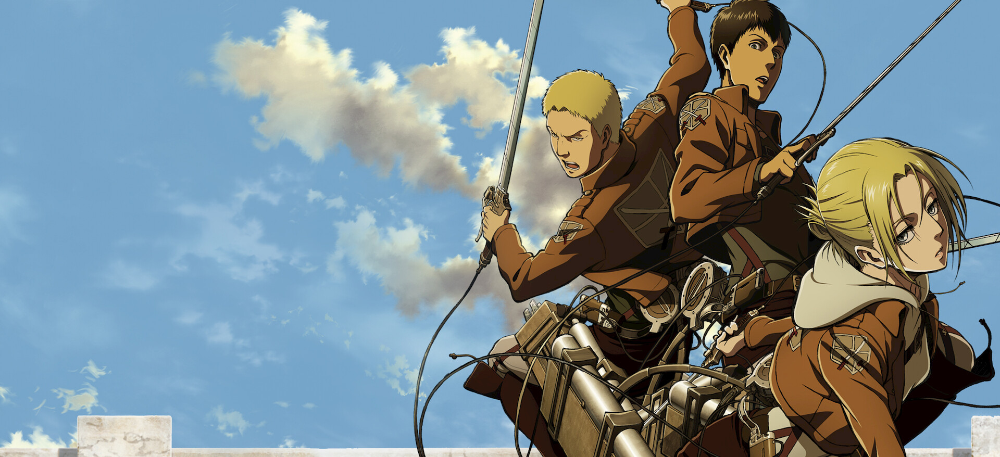
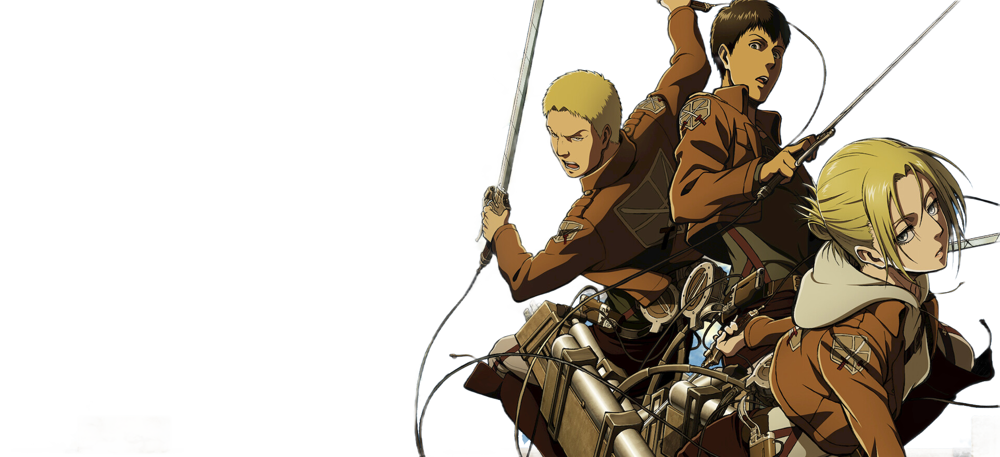

# Smart Background Remover

[Tiếng Việt bên dưới](#tiếng-việt)

A high-precision, offline Python tool designed to remove backgrounds from both logos/graphics and complex illustrations. It supports three distinct modes:
1. **Solid Mode (`--mode solid`)**: A custom flood-fill algorithm based on color distance that is pixel-perfect for logos, icons, and flat vectors on a solid background (preserves outline borders where AI usually fails).
2. **AI Mode (`--mode ai`)**: Integrated deep learning segmentation via `rembg` (supporting models like `isnet-anime` and `birefnet-general`) for general photos and objects.
3. **Hybrid Mode (`--mode hybrid`)**: Combines AI segmentation (`isnet-anime`) with a **Core Protection Mask** and **Color-Distance Keying**. This is the ultimate mode for complex illustrations (e.g. anime characters) to cleanly remove background bleeding between fine hair strands while keeping the face, eyes, and clothing 100% solid.

---

## Visual Demos

### 1. Solid Mode (`--mode solid`) - Best for Logos & Badges
*Perfect for flat designs. Preserves delicate details like logo borders and typography without any distortion.*

| Input Image (`images/logo-03.cc5e5332.png`) | Output Image (`images/logo_output.png`) |
| --- | --- |
|  |  |

### 2. Hybrid Mode (`--mode hybrid`) - Best for Complex Drawings & Anime Hair
*Handles gradient backgrounds, floating objects, and fine hair details without leaving background color casts or bleeding.*

| Input Image (`images/aot_input.jpg`) | Output Image (`images/aot_hybrid.png`) |
| --- | --- |
|  |  |

---

## Features
- **Three Processing Engines:** Choose between Solid, AI, or Hybrid mode based on your image type.
- **Core Protection Mask:** Hybrid mode protects the inner parts of the character (eyes, face, body) using binary erosion, ensuring color-keying only cleans up outer hair strands and gaps.
- **Preserves Details:** Solid mode guarantees 100% border preservation (won't crop circular frames or thin lines).
- **Soft-Alpha Edge Matting:** Smooths borders to completely eliminate pixelated edges or color halos.
- **Full Resolution:** Keeps 100% of the original resolution and quality (supports 2K, 4K, 8K+).
- **100% Offline & Private:** Run completely locally on your system.

---

## Installation

1. Clone this repository.
2. Install the core dependencies:
   ```bash
   pip install -r requirements.txt
   ```
3. *(Optional)* If you plan to use the **AI Mode** or **Hybrid Mode**, install the AI engine:
   ```bash
   pip install rembg
   # For GPU acceleration, run instead:
   # pip install rembg[gpu]
   ```

---

## Usage

Run the tool via terminal:
```bash
python remove_bg_smart.py <input_path> <output_path> [options]
```

### Options:
- `--mode {solid,ai,hybrid}`: Select processing engine. Default is `solid`.
- `--model MODEL`: Specify AI model name (for `ai` and `hybrid` modes). 
  - `isnet-anime` (default): Best for anime and illustrations.
  - `birefnet-general`: Best for real photos and objects.
- `--tolerance TOL`: Color threshold limit for background detection (default: `40` for solid, `75` for hybrid).
- `--low-tolerance LOW_TOL`: Edge blending lower limit for soft transparency (default: `15` for solid, `35` for hybrid).
- `--erosion-iterations ITER`: Size of the protection mask (default: `15`, only in `hybrid` mode). Higher values protect more of the inner body.
- `--alpha-matting`: Use rembg built-in alpha matting (only in `ai` mode).

### Examples:
**Tách nền logo phẳng (Solid Mode):**
```bash
python remove_bg_smart.py images/logo-03.cc5e5332.png images/logo_output.png --mode solid
```

**Tách tranh anime phức tạp (Hybrid Mode - Khuyên dùng cho tóc khó):**
```bash
python remove_bg_smart.py images/aot_input.jpg images/aot_hybrid.png --mode hybrid --model isnet-anime
```

---

<a name="tiếng-việt"></a>
# Smart Background Remover (Bộ Tách Nền Thông Minh)

Công cụ Python chạy offline với độ chính xác cao, hỗ trợ tách nền cho cả logo phẳng đơn sắc và tranh vẽ minh họa phức tạp. Dự án tích hợp ba chế độ hoạt động:

1.  **Solid Mode (`--mode solid`)**: Thuật toán loang vùng (flood-fill) tùy biến. Cực kỳ chính xác cho logo, icon trên nền phẳng (bảo vệ viền tròn ngoài mà AI thường cắt lẹm).
2.  **AI Mode (`--mode ai`)**: Sử dụng mạng nơ-ron thông qua thư viện `rembg` cho ảnh chụp và vật thể thông thường.
3.  **Hybrid Mode (`--mode hybrid`)**: Kết hợp phân tách AI (`isnet-anime`) với **Mặt nạ bảo vệ lõi** (Core Protection Mask) và **Khoảng cách màu**. Đây là chế độ tốt nhất cho tranh anime phức tạp, giúp xóa sạch màu nền bị kẹt giữa các khe tóc nhỏ mà không làm hỏng mắt, da, hay quần áo nhân vật.

## Lệnh mẫu:
**Tách logo nền phẳng:**
```bash
python remove_bg_smart.py images/logo-03.cc5e5332.png images/logo_output.png --mode solid
```

**Tách hình vẽ anime phức tạp (Chế độ Hybrid - Sạch kẽ tóc):**
```bash
python remove_bg_smart.py images/aot_input.jpg images/aot_hybrid.png --mode hybrid
```
